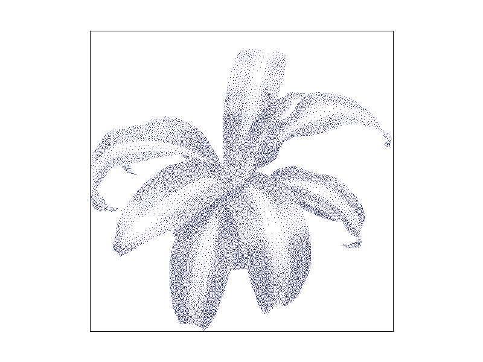
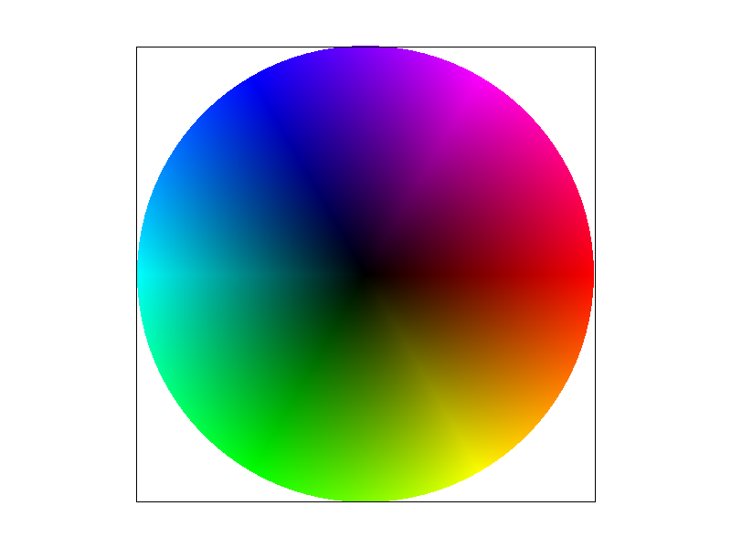

# Project 1: Rasterizer

> Spring 2021

[Project Specs](https://cs184.eecs.berkeley.edu/sp21/docs/proj1-spec)

## Output

### Task 1

- basic1:

- basic2:

- basic3:

- basic4:

- basic5:

- basic6:

 

- basic7:

 